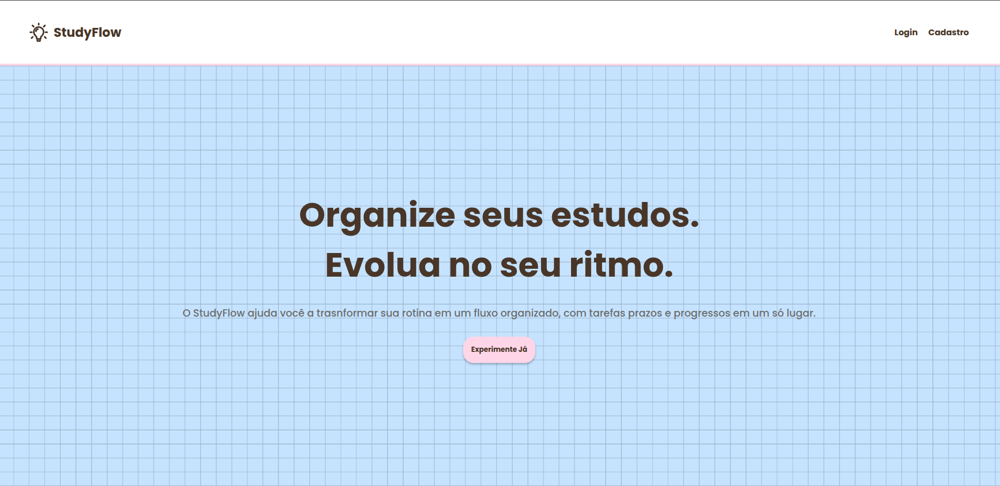
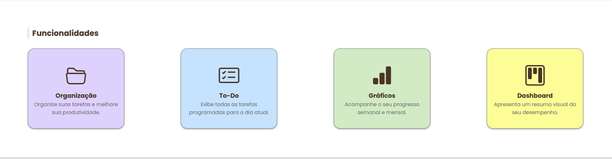
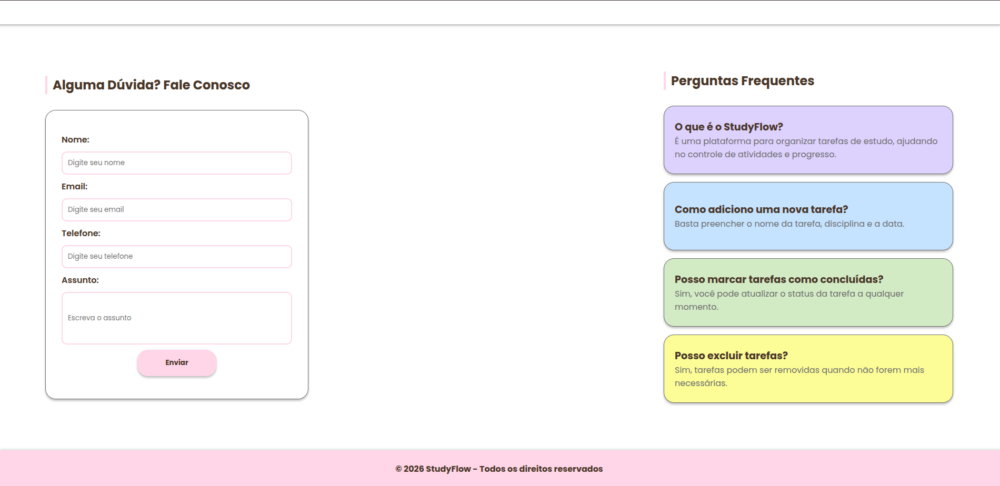
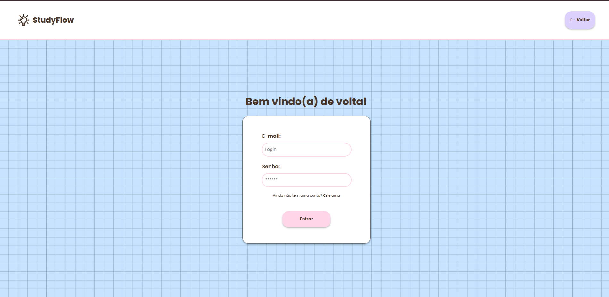
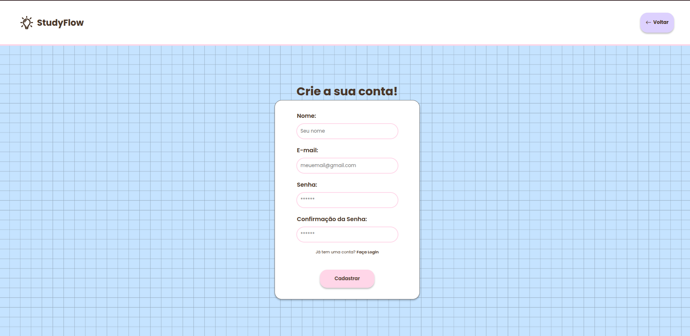
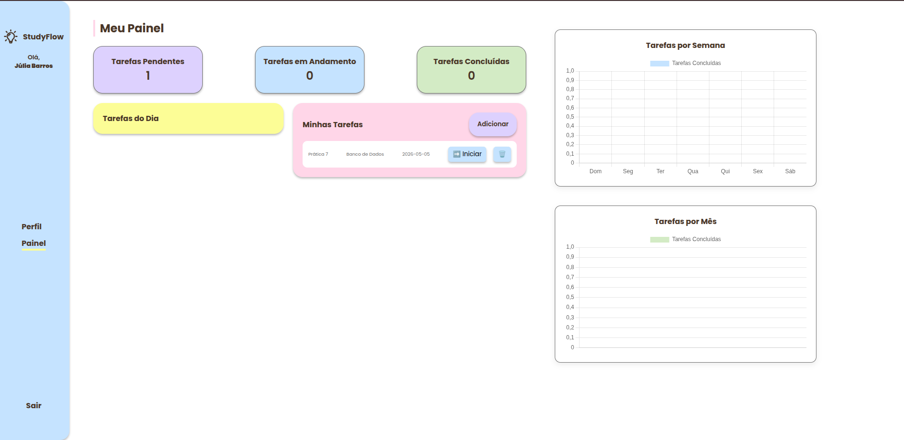
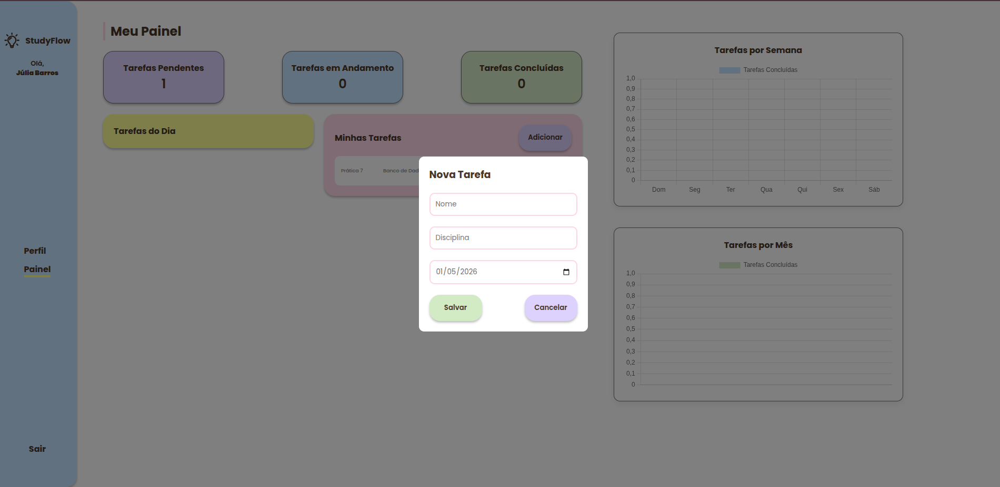
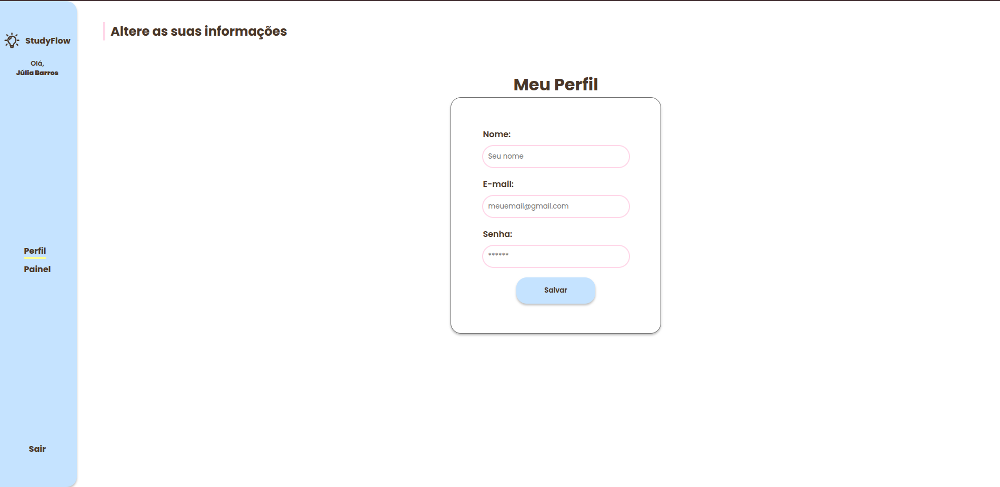

<h2><b>StudyFlow
</b></h2>

<h2>| Sobre o Projeto </h3>
  
O <b>Study Flow</b> é um sistema web de planejamento de estudos que auxilia estudantes na organização de tarefas, controle de tempo e acompanhamento de produtividade.  

<h2>| Funcionalidades </h3>
🔐 Cadastro e login de usuários  
📊 Dashboard com indicadores de progresso  
📚 Cadastro de tarefas de estudo 
📅 Visualização de tarefas do dia  
✔️ Marcar tarefas como concluídas  
🗑️ Exclusão de tarefas  

<h2>| Demonstração </h3>
<h3> - Página Home </h3>
  

  

  

<h3> - Login </h3>
  

<h3> - Cadastro </h3>
  

<h3> - Dashboard </h3>
  

  

  

<h2>| Tecnologias Usadas </h2>
- HTML5  
- CSS3  
- JavaScript <i class="bi bi-javascript"></i>  
- NodeJS  
- API web-data-viz

<h2>| Como Usar </h2>
1. Clone o repositório:
<b>https://github.com/devjuliabarros/StudyFlow.git </b>  
2. Acesse o diretório do projeto no terminal com o comando <b> cd StudyFlow/</b>  
3. Execute o comando<b>  npm start </b>  
4. Acesso o endereço do servidor <b>http://localhost:3333/</b> no seu navegador    

| 🩷💡 Desenvolvido por <b>Júlia Barros </b>